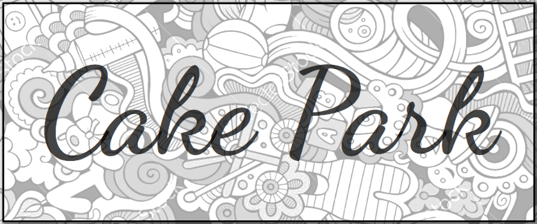
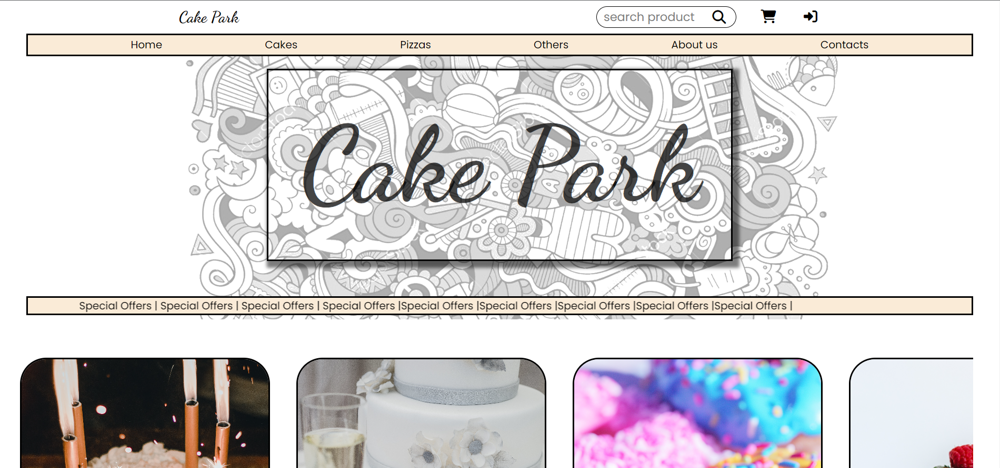
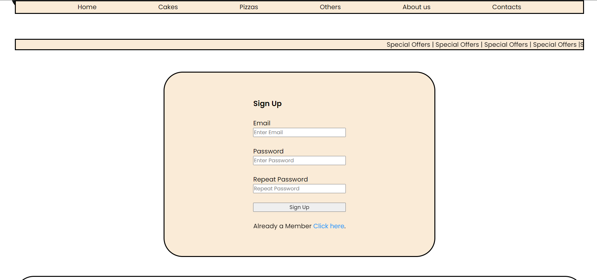

# Cake Park Website

Welcome to the Cake Park website repository! This repository contains the source code and assets for the Cake Park website, an online platform to explore and order delicious cakes and pastries. The website features a responsive navbar, a homepage showcasing various cake offerings, and a login page for user authentication.

## Features

- Navbar: The website includes a responsive navigation bar that allows users to easily navigate through different sections of the website.
- Homepage: The homepage displays an enticing selection of cakes and pastries, enticing users to explore and make a purchase.
- Login Page: Users can log in to access additional features or personalized recommendations.

## Screenshots

## Technologies Used

- HTML
- CSS
- JavaScript

# To run the Cake Park website locally, follow these steps:

1. Clone the repository
2. cd CakeParkWebsite
3. Run index.html

## Usage
- Explore the website by clicking on the navigation links in the navbar to visit different sections.
- Browse through the various cake offerings and click on them to view more details.
- Log in to access additional features or personalized recommendations.

## Future Enhancements
- Add an ordering system to allow users to place cake orders directly through the website.
- Implement user registration functionality to allow new users to create accounts.

## Contributing
Contributions are welcome! If you have any ideas for improvements or would like to fix any issues, please submit a pull request or open an issue in the repository.
